  <picture>
    <source media="(prefers-color-scheme: dark)" srcset="assets/header.svg"/>
    <source media="(prefers-color-scheme: light)" srcset="assets/header-light.svg"/>
    
  </picture>

  <picture>
    <source media="(prefers-color-scheme: dark)" srcset="assets/about.svg"/>
    <source media="(prefers-color-scheme: light)" srcset="assets/about-light.svg"/>
    
  </picture>

 

<h2 align="center">🛠️ Tech Stack</h2>

  <picture>
    <source media="(prefers-color-scheme: dark)" srcset="assets/tech.svg"/>
    <source media="(prefers-color-scheme: light)" srcset="assets/tech-light.svg"/>
    
  </picture>

 

<h2 align="center">📊 GitHub Stats</h2>

  <picture>
    <source media="(prefers-color-scheme: dark)" srcset="assets/stats.svg"/>
    <source media="(prefers-color-scheme: light)" srcset="assets/stats-light.svg"/>
    
  </picture>
  <picture>
    <source media="(prefers-color-scheme: dark)" srcset="assets/langs.svg"/>
    <source media="(prefers-color-scheme: light)" srcset="assets/langs-light.svg"/>
    
  </picture>

  <picture>
    <source media="(prefers-color-scheme: dark)" srcset="assets/streak.svg"/>
    <source media="(prefers-color-scheme: light)" srcset="assets/streak-light.svg"/>
    
  </picture>

  <picture>
    <source media="(prefers-color-scheme: dark)" srcset="assets/activity.svg"/>
    <source media="(prefers-color-scheme: light)" srcset="assets/activity-light.svg"/>
    
  </picture>

 

<h2 align="center">🤝 Connect With Me</h2>

<!-- Replace each # with your link, or delete any you don't use -->

  
  
  
  

 

<h2 align="center">🧠 Motto</h2>

  <picture>
    <source media="(prefers-color-scheme: dark)" srcset="assets/motto.svg"/>
    <source media="(prefers-color-scheme: light)" srcset="assets/motto-light.svg"/>
    
  </picture>

